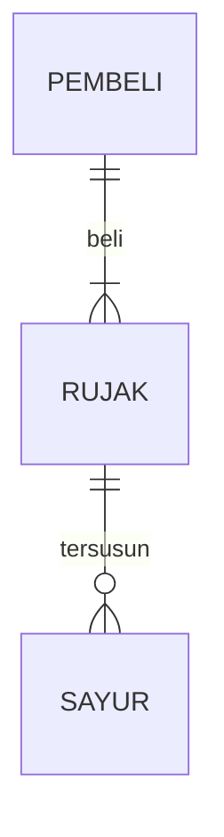

## 1. Where's App
## Menyimpan Keuangan Tanpa Kebingungan (Tagline)

## 1.1 Latar Belakang
Aplikasi " Where's App" ini dibentuk karena kita sebagai Mahasiswa ataupun masyarakat biasanya memiliki kendala pada masalah pengeluaran uang pada setiap harinya,terkadang kita terlalu banyak menghabiskan uang yang kita miliki namun tidak mengetahui bahwa uang yang dikeluarkan berapa nominalnya dan kemana arah perginya, dengan itu kita  aplikasi ini dapat mengatur uang yang masuk dan keluar agar teratur, 

Kebutuhan akan aplikasi pencatat keuangan yang Lebih sederhana dan fitur yang membantu membuat pengguna dari segala kalangan usia dapat menggunakannya,karena terkedang aplikasi kebanyakan yang memiliki interface yang sulit untuk dipahami oleh semua orang  

## 1.2. Deksripsi Teknologi Informasi
"Where's App" Adalah Aplikasi pencatat keuangan untuk mencatat keuangan seseorang yang masuk dan keluarnya uang namun memiliki banyak keunggulannya
yanh di desain dengan  iterface yang sederhana membantu pengguna dalam menggunakan aplikasi(interaktif).

Dengan Applikasi "Where'App" anda mendapaatkan keunggulan sebagai berikut.
1. Menyimpan Keuangan  : "Where's App dapat membantu Anda menambahkan ,mengedit ,dan menghapus data anda yang sudah tidak terpakai lagi
2. Menjaga Keuangan    : dengan aplikasi anda memiliki pembatas keluarnya pengeluaran , dan pengguna anda diberikan peringatan untuk menjaga                  pengeluarannya agar keuangan anda tetap terjaga.
3. Menganalisis Keuangan : dengan "Where's App"Anda dapat melihat pembanding pengeluaran tiap bulan atau tiap tahuunnya ,dan anda dapat menjelajah            history uang yang masuk atau keluar 

## 1.3. Branding
Aplikasi "Where's App" Memiliki fitur yang membantu para usernya supaya pengguna dapat merasakan kenyamanan dan kemudahan dalam menggunakan aplikasi "Where's App"ini  diantarnya terdapat :
1.fitur pembatas keuangan, fitur ini berfungsi sebagai pembatas keluarnya pengeluaran berbentuk persentase, jika pengguna melebihi dari yang dibataskan pengguna akan diberikan peringatan untuk menjaga pengeluarannya, fitur ini berfungsi agar pengguna dapat menjaga pengeluarnya uangnya agar tetap terkendali
2.fitur tabungan untuk setiap bulannya yang akan dipotong setiap uang yang masuk dalam 1 hari tiap bulanya
3.pengeluaran dan pemasukan uang yang dapat dibuat,diedit,dan dihapus agar user mudah dalam menggunakan
4.Terdapat Pie Chart pada widget agar pengguna dapat membandingkan pengeluaran tiap bulan atau tiap tahuunnya
5. Pengguna dapat menjelajah history uang yang masuk atau keluar yang akan menampilkan kapan uang tersebut dimasukan atau dikeluarkan
## 2. User Story
NO | Target(Personal,fungsi dan tujuan |rate | 
---|---|---|
1| Sebagai seorang User berusia 50 tahun, saya ingin memiliki kemudahan dalam menggunakam aplikasi ,Widget sederhana dan penempatannya yang sesuai agar saya yang awam dapat menggunakannya tanpa ada kesulitan |  ⭐⭐⭐⭐⭐
2|Sebagai seorang mahasiswa,saya ingin memiliki fitur notes untuk membuat catatan agar saya dapat menggunakanya sebagai pengingat ketika saya mengeluarkan uang |⭐⭐⭐⭐|
3|Sebagai seorang Pengelola keuangan UMKM, saya ingin memiliki Kumpulan data /Charts agar saya dapat menggunakan charts tersebut sebagai untuk membandungkan data-data yang pernah ada sebelumnya dan melihat perbedaanya |⭐⭐⭐|
4| Sebagai seorang user, saya ingin memiliki fitur untuk menambah suatu data agar saya dapat menambahkan data tersebut dalam aplikasi|⭐⭐⭐⭐⭐|
5| Sebagai seorang user, saya ingin memiliki fitur untuk menghapus sebuah data agar  membantu saya dalam menghapus data yang sudah saya tidak inginkan|⭐⭐⭐⭐⭐|
6|---|⭐⭐⭐⭐⭐|
7|---|---|
---|---|---|

 

## 3. Struktur Data

Cara membuat aneka macam bentuk grafik menggunakan mermaid.js bisa lihat di [https://mermaid.js.org/syntax/entityRelationshipDiagram.html](https://mermaid.js.org/syntax/entityRelationshipDiagram.html) 

## 4. Arsitektur Sistem

Masih pake mermaid.js juga bisa lihat flowchart di [https://mermaid.js.org/syntax/flowchart.html](https://mermaid.js.org/syntax/flowchart.html)

## 5. Teknologi, Library, dan Framework

bla bla bla

## 6. Desain User Experience dan User Interface

Bisa load image 

## 7. Demonstrasi Video

Link youtube nya

## 8. Bagaimana mesin komputasi dan sistem operasi berperan dalam produk teknologi informasimu ?

Link youtube nya di detik jawaban ini

## 9. Bagaimana algoritma, struktur data, dan bahasa pemrograman berperan dalam produk teknologi informasimu ?

Link youtube nya di detik jawaban ini

## 10. Bagaimana metode pengembangan perangkat lunak / Software Development Life Cycle berperan dalam produk teknologi informasimu ?

Link youtube nya di detik jawaban ini

## 11. Bagaimana database / sistem basis data berperan dalam produk teknologi informasimu ?

Link youtube nya di detik jawaban ini
