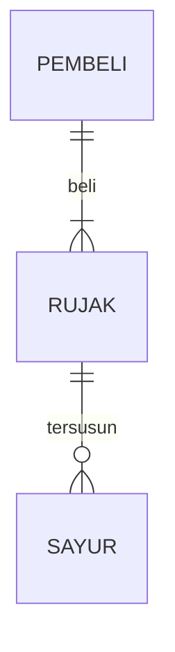

## 1 Where's App
## Menyimpan Keuangan Tanpa Kebingungan (Tagline)

## 1.1 Latar Belakang
Pembuatan aplikasi ini dibentuk karena kita sebagai Mahasiswa biasanya memiliki kendala pada masalah pengeluaran uang pada setiap harinya,terkadang kita terlalu banyak menghabiskan uang yang kita miliki namun tidak mengetahui bahwa uang yang dikeluarkan berapa nominalnya dan kemana perginya, dengan itu kita membutuhkan aplikasi ini untuk mengatur uang yang masuk dan keluar agar tidak berlebihan 

## 1.2. Deksripsi Teknologi Informasi
Aplikasi pencatat keuangan ini seperti aplikasi pencatat pada umumnya untuk mencatat keuangan seseorang yang masuk dan keluarnya uang,kita dapat menambahkan ,mengedit ,dan menghapus data kita dalam catatatn keuagangan kita  ,didalam aplikasi ini memiliki beberapa fitur diantaaranya, memiliki pembatas keluarnya pengeluaran berbentuk persenan, jika melebihi dari yang dibataskan pengguna akan diberikan peringatan untuk menjaga pengeluarannya, fitur tabungan untuk mencatat penyimpanan uang, lalu terdapat Pie Chart pada widget agar pengguna dapat membandingkan pengeluaran tiap bulan atau tiap tahuunnya ,dan terakhir Pengguna dapat menjelajah history uang yang masuk atau keluar yang akan menampilkan kapan uang tersebut dimasukan atau dikeluarkan

## 1.3. Branding
Aplikasi ini Memiliki fitur yang membantu para usernya supaya pengguna dapat merasakan kenyamanan dan kemudahan dalam menggunakan aplikasi Where's App ini  diantarnya terdapat 
1.fitur pembatas keuangan, fitur ini berfungsi sebagai pembatas keluarnya pengeluaran berbentuk persentase, jika pengguna melebihi dari yang dibataskan pengguna akan diberikan peringatan untuk menjaga pengeluarannya, fitur ini berfungsi agar pengguna dapat menjaga pengeluarnya uangnya agar tetap terkendali
2.fitur tabungan untuk setiap bulannya yang akan dipotong setiap uang yang masuk dalam 1 hari tiap bulanya
3.pengeluaran dan pemasukan uang yang dapat dibuat,diedit,dan dihapus agar user mudah dalam menggunakan
4.Terdapat Pie Chart pada widget agar pengguna dapat membandingkan pengeluaran tiap bulan atau tiap tahuunnya
5. Pengguna dapat menjelajah history uang yang masuk atau keluar yang akan menampilkan kapan uang tersebut dimasukan atau dikeluarkan
## 2. User Story

    NO|Target(Personal) , Fungsi dan Tujuan | Rate
    ---|---|---
1 | Sebagai seorang User, saya ingin memiliki kemudahan dalam menggunakam aplikasi ,Widget sederhana dan penempatannya yang sesuai agar saya yang awam dapat menggunakannya tanpa ada kesulitan |⭐⭐⭐⭐⭐ | 

## 3. Struktur Data

Cara membuat aneka macam bentuk grafik menggunakan mermaid.js bisa lihat di [https://mermaid.js.org/syntax/entityRelationshipDiagram.html](https://mermaid.js.org/syntax/entityRelationshipDiagram.html) 

## 4. Arsitektur Sistem

Masih pake mermaid.js juga bisa lihat flowchart di [https://mermaid.js.org/syntax/flowchart.html](https://mermaid.js.org/syntax/flowchart.html)

## 5. Teknologi, Library, dan Framework

bla bla bla

## 6. Desain User Experience dan User Interface

Bisa load image 

## 7. Demonstrasi Video

Link youtube nya

## 8. Bagaimana mesin komputasi dan sistem operasi berperan dalam produk teknologi informasimu ?

Link youtube nya di detik jawaban ini

## 9. Bagaimana algoritma, struktur data, dan bahasa pemrograman berperan dalam produk teknologi informasimu ?

Link youtube nya di detik jawaban ini

## 10. Bagaimana metode pengembangan perangkat lunak / Software Development Life Cycle berperan dalam produk teknologi informasimu ?

Link youtube nya di detik jawaban ini

## 11. Bagaimana database / sistem basis data berperan dalam produk teknologi informasimu ?

Link youtube nya di detik jawaban ini
