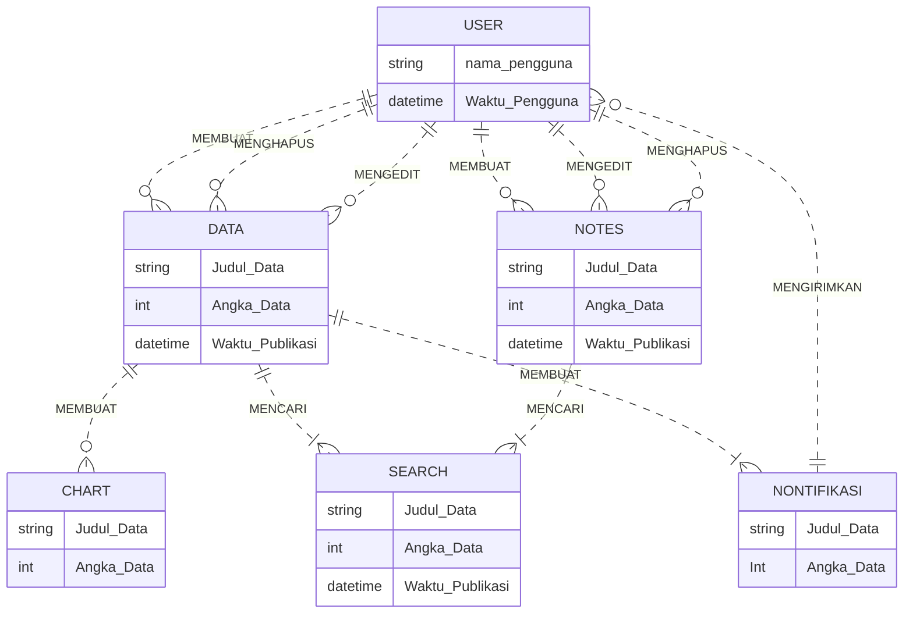
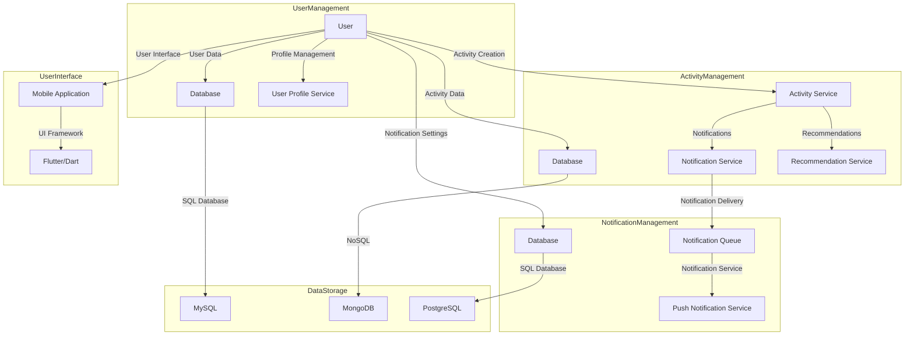

## 1. Where's App

## 1.1 Latar Belakang
Aplikasi " Where's App" ini dibentuk sebagai solusi bagi sesorang dalam mengatur keuangannya dimanapun kapanpun dan saat seseorang memiliki kendala pada masalah pengeluaran uang pada setiap harinya,terkadang orang" terlalu banyak menghabiskan uang yang dimiliki namun tidak mengetahui bahwa uang yang dikeluarkan berapa nominalnya dan kemana arah perginya, dengan itu aplikasi ini dapat mengatur uang yang masuk dan keluar agar teratur.

Aplikasi "Where's App" ini dapat membantu masyarakat juga dalam meningkatkan kesejahteraan ekonomi pengguna dengan cara meningkatkan pentingnya uang yang dikeluarkan dalam pengeluarannya, terkadang banyak masyarakat yang tidak menyadari betapa pentingnya uang yang dikeluarkan sekecil apapun.

Kebutuhan akan aplikasi pencatat keuangan yang Lebih sederhana, dan fitur yang membantu membuat pengguna dari segala kalangan usia dapat menggunakannya,karena terkedang aplikasi kebanyakan yang memiliki interface yang sulit untuk dipahami oleh semua orang .

 HP Finace,2019| 
---|
IQPlus, (02/05) - Otoritas Jasa Keuangan (OJK) menyebutkan budaya menabung di Indonesia terbilang rendah dibandingkan dengan negara tetangga. Bahkan rasio tabungan terhadap Produk Domestik Bruto (PDB) Indonesia berada di urutan ke-4 setelah Brunei Darussalam, Singapura, dan Thailand."Menurut data World Bank, rasio kepemilikan rekening bank pada penduduk usia di atas 15 tahun terbilang rendah yakni pada 2016 baru mencapai 48,9 persen," kata Ketua Dewan Komisioner OJK Wimboh Santoso,Kamis.Ia menambahkan rata-rata rasio tabungan rumah tangga Indonesia terhadap total pendapatannya juga relatif rendah yakni hanya sebesar 8,5 persen. Rumah tangga yang memiliki pendapatan paling rendah hanya memiliki rasio tabungan sebesar 5,2 persen, sedangkan rumah tangga Indonesia yang berpendapatan paling tinggi memiliki rasio hanya 12,60 persen.
"Potensi dana masyarakat yang bisa dimobilisasi sebenarnya cukup besar, yaitu dari jumlah pelajar yang mencapai 69,3 juta, mencapai 25,8 persen dari total jumlah penduduk Indonesia, dan jumlah penduduk pada kelompok pemuda dan mahasiswa sebanyak 55 juta," tuturnya. Untuk itu, tambahnya, adalah hal yang penting untuk mengubah mentalitas masyarakat menjadi giat menabung dan berinvestasi untuk kegiatan produktif. "Konsumsi boleh, namun jangan lupa untuk menempatkan sejumlah dana dalam tabungan untuk berjaga-jaga dan juga melakukan investasi guna kesejahteraan di masa depan," pungasnya. |

Data yang didapat pada CNN Indonesia Menteri Keuangan (Menkeu) Sri Mulyani menyindir generasi milenial yang tak paham krisis keuangan , dan banyaknya kenaikan harga pokok yang semakin mencekik masyarakat membuat harga konsumsi lainnya menjadi naik.

Jakarta, CNBC Indonesia( Kepala Badan Pusat Statistik (BPS) |
---|
Harga beras, gula, dan cabai dalam tren naik.Menurut Amalia, harga gula mengalami kenaikan di 338 kabupaten/ kota di Indonesia, harga beras naik di 283 kabupaten/ kota, dan cabai rawit naik di 259 kabupaten/ kota.Jika melihat data pantauan harga sembako rata-rata harian nasional di tingkat pedagang eceran, Panel Harga Badan Pangan mencatat harga beras hari ini memang masih terpantau mahal| 

Mulailah menabung dalam aplikkasi digital, Setiap rupiah yang disimpan adalah langkah menuju kemerdekaan finansial, keamanan, dan kesempatan untuk mewujudkan impian. Setiap langkah kecil menuju tabungan adalah langkah besar menuju kebebasan finansial dan kemandirian.

## 1.2. Deksripsi Teknologi Informasi
"Where's App" Adalah Aplikasi pencatat keuangan yang sederhana namun memiliki banyak keunggulannya
yang di desain dengan interface sederhana membantu pengguna dalam menggunakan aplikasi(interaktif).

Dengan Applikasi "Where's App" anda mendapaatkan keunggulan sebagai berikut:

1. Menyimpan Keuangan  : "Where's App dapat membantu Anda menambahkan ,mengedit ,dan menghapus data anda yang sudah tidak terpakai lagi
2. Menjaga Keuangan    : dengan aplikasi anda memiliki pembatas keluarnya pengeluaran , dan pengguna anda diberikan peringatan untuk menjaga pengeluarannya agar keuangan anda tetap terjaga.
3. Menganalisis Keuangan : dengan "Where's App"Anda dapat melihat pembanding pengeluaran tiap bulan atau tiap tahuunnya ,dan anda dapat menjelajah history uang yang masuk atau keluar 

## 1.3. Branding
Tagline : Menyimpan Dengan Arah - _Save with directions_ 

Aplikasi "Where's App" Memiliki fitur yang membantu anda agar merasakan kenyamanan dan kemudahan dalam menggunakan aplikasi "Where's App"ini  diantarnya terdapat :

1. Fitur pembatas keuangan, fitur ini berfungsi sebagai pembatas keluarnya pengeluaran berbentuk persentase, jika anda melebihi dari yang dibataskan anda akan diberikan peringatan untuk menjaga pengeluarannya, fitur ini berfungsi agar anda dapat menjaga pengeluarnya uangnya agar tetap terjaga

2. Fitur tabungan, Fitur ini membantu anda dalam menyimpan keuangan

3. Fitur pengeluaran dan pemasukan uang yang dapat dibuat,diedit,dan dihapus agar anda mudah dalam mengoprasikan aplikasi "Where'App"

4. Fitur Chart, berfungsi sebagai pembanding anda dalam mengeluarkan atau memasukan data sebelumnya yang berbentuk Pie Chart 

5. Pengguna dapat menjelajah history uang yang masuk atau keluar yang akan menampilkan kapan uang tersebut dimasukan atau dikeluarkan

Target User :
 Usia 6+
 
 1. Siswa dan mahasiswa yang sering kesulitan dalam mencatat keuangannya.
 2. Seorang pekerja yang memiliki waktu yang padat setiap harinya dan tidak memiliki waktu untuk melakukan kegiatan yang membutuhkan waktu yang lama.
 3. Ibu Rumah tangga yang memiliki kesulitan dalam mengatur keuangan dalam rua=mah tangga.
 4. Orang yang peduli tentang keuangan yang dimiliki dan ingin menjanganya agar keuangan tetap terjaga.
 5. Orang-orang yang mencari solusi dalam meningkatkan kestabilann pengelolaan keuangan
 6. Seorang pengusaha yang ingin memiliki pencatatan keuntungan, kerugian usahanya 

Warna :
Homepage :  Biru :#0039d9  ,  kuning : #ffc107  ,  putih :#ffffff  ,  Hijau :#50b154   ,   Merah : #f44336   ,   hitam : #030303

Notespage : Putih : #fafafa ,  Merah : #f44336 , Black : #000000 , abu #d3d3d3

 
## 2. User Story
NO | Target(Personal,fungsi dan tujuan |Prioritas| 
---|---|---|
1| Sebagai seorang User berusia 50 tahun, saya ingin memiliki kemudahan dalam menggunaka aplikasi ,Widget sederhana dan penempatannya yang sesuai agar saya yang awam dapat menggunakannya tanpa ada kesulitan |  ⭐⭐⭐⭐⭐
2|Sebagai seorang mahasiswa,saya ingin memiliki  notes untuk membuat catatan agar saya dapat menggunakanya sebagai pengingat ketika saya mengeluarkan uang |⭐⭐⭐⭐|
3|Sebagai seorang Pengelola keuangan UMKM, saya ingin memiliki Kumpulan data /Charts agar saya dapat menggunakan charts tersebut sebagai untuk membandingkan data-data yang pernah ada sebelumnya dan melihat perbedaanya |⭐⭐⭐|
4| Sebagai seorang user, saya ingin memiliki fitur untuk menambah suatu data agar saya dapat menambahkan data tersebut dalam aplikasi|⭐⭐⭐⭐⭐|
5| Sebagai seorang user, saya ingin memiliki fitur untuk menghapus sebuah data agar  membantu saya dalam menghapus data yang sudah saya tidak inginkan|⭐⭐⭐⭐⭐|
6|Sebagai seorang user, saya ingin memiliki fitur untuk mengedit data agar hal tersebut dapat membantu saya dalam mengedit data yang terdapat kesalahan|⭐⭐⭐⭐⭐|
7|Sebagai seorang user saya ingin melihat panduan penggunaan aplikas agar saya dapat mengerti penggunaan aplikasi|⭐⭐⭐⭐⭐|
8|Sebagai seorang user saya ingin mencari data yang telah ditambahkan dalam aplikasi agar saya dapat melihat datanya kembali ketika dibutuhkan |⭐⭐⭐⭐
9|Sebagai seorang user saya ingin mencari catatan yang telah ditambahkan dalam aplikasi agar  saya dapat melihat datanya kembali ketika dibutuhkan|⭐⭐⭐⭐
10|Sebagai seorang user saya ingin data setiap hari menyusun sesuai dengan urutan alfabetnya|⭐⭐⭐
11|Sebagai seorang user saya ingin melihat aktivitas riwayat data saya yang telah saya simpan|⭐⭐⭐⭐
12|Sebagai seorang user saya ingin melihat aktivitas riwayat note data saya yang telah saya simpan|⭐⭐⭐⭐
13|Sebagai seorang user saya ingin melihat aktivitas riwayat data saya yang telah saya hapus dari daftar keuangan|⭐⭐⭐
12|Sebagai seorang user saya ingin melihat aktivitas riwayat catatan data saya yang telah saya hapus dari catatan keuangan|⭐⭐⭐
13|Sebagai seorang user saya ingin mendaftarkan akun dengan cepat dan mudah|⭐⭐⭐⭐
14|Sebagai seorang user saya ingin akun yang saya gunakan dapat digunakan di device yang lain agar memudahkan saya ketika berganti device|⭐⭐⭐⭐
15|Sebagai seorang user saya ingin mendapatkan privasi keamanan dan kenyamanan ketika menggunakan aplikasi|⭐⭐⭐⭐⭐
16|Sebagai seorang user saya ingin masuk ke akun saya dengan mudah dengan akun yang sudah saya daftarkan |⭐⭐⭐⭐
17|Sebagai seorang user saya ingin memiliki pengaturan pada aplikasi agar saya dapat dengan mudah merubah dengan hal yang saya inginkan|⭐⭐⭐⭐⭐
18|Sebagai seorang user saya ingin mengunjungi profil saya pada pengaturan|⭐⭐⭐
19|Sebagai seorang user saya ingin memiliki foto profile pengguna|⭐⭐⭐
20|Sebagai seorang user saya ingin dapat mengganti foto profile saya|⭐⭐⭐
21|Sebagai seorang user saya ingin dapat menghapus foto profile saya |⭐⭐⭐
22|Sebagai seorang user saya ingin ketika dalam laman Homepage saya dapat berpindah ke laman Notespage|⭐⭐⭐⭐
23|Sebagai seorang user saya ingin ketika dalam laman Homepage saya dapat berpindah ke laman Searchpage|⭐⭐⭐⭐
24|Sebagai seorang user saya ingin ketika dalam laman Homepage saya dapat berpindah ke laman Barpage|⭐⭐⭐⭐
25|Sebagai seorang user saya ingin ketika dalam laman Searchpage saya dapat berpindah kembali ke laman   Homepage|⭐⭐⭐⭐
26|Sebagai seorang user saya ingin ketika dalam laman Searchpage saya dapat berpindah ke laman   Notespage|⭐⭐⭐⭐
27|Sebagai seorang user saya ingin ketika dalam laman Searchpage saya dapat berpindah ke laman Barpage|⭐⭐⭐⭐
28|Sebagai seorang user saya ingin ketika dalam laman NotesPage saya dapat berpindah kembali ke laman   Homepage|⭐⭐⭐⭐
29|Sebagai seorang user saya ingin ketika dalam laman NotesPage saya dapat berpindah ke laman  SearchPage|⭐⭐⭐⭐
30|Sebagai seorang user saya ingin ketika dalam laman NotesPage saya dapat berpindah ke laman  Barpage|⭐⭐⭐⭐
31|Sebagai seorang user saya ingin ketika dalam laman Barpage saya dapat berpindah kembali ke laman Homepage|⭐⭐⭐⭐
32|Sebagai seorang user saya ingin ketika dalam laman Barpage saya dapat berpindah ke laman Searchpage|⭐⭐⭐⭐
33|Sebagai seorang user saya ingin ketika dalam laman Barpage saya dapat berpindah ke laman Notepage|⭐⭐⭐⭐
34|Sebagai seorang user saya ingin ketika dalam seacrhbar ingin memilik tombol untuk mengclose serachbar tersebut ketika tidak jadi digunakan|⭐⭐⭐
35|Sebagai seorang user saya ingin memiliki tombol menyimpan atau "Save" dalam penambahan notes untuk menyimpan notes yang telah saya masukan|⭐⭐⭐⭐
36|Sebagai seorang user saya ingin memiliki tombol menyimpan atau "Save" dalam penambahan catatan keuangan untuk menyimpan data yang telah saya masukan|⭐⭐⭐⭐
37|Sebagai seorang user saya ingin mendapakan nontifikasi untuk mengingat tentang pengeluaran yang terlah dilakukan|
38|Sebagai seorang user saya ingin mendapatkan keamanan yang terupdate selalu|⭐⭐⭐
39|Sebagai seorang user saya ingin aplikasi mendapatkan update secara berkala |⭐⭐⭐⭐⭐
40|Sebagai seorang user saya ingin aplikasi nyaman digunakan terhindar dari bug |⭐⭐⭐⭐⭐

## 3. Struktur Data

## 4. Arsitektur Sistem

## 5. Teknologi, Library, dan Framework
- Bahasa Pemrograman:
  Dart  : Bahasa pemrograman yang umum digunakan untuk pengembangan aplikasi Mobile. Digunakan di sisi klien (front-end) untuk membuat antarmuka pengguna yang responsif dan berinteraksi dengan pengguna.
- Basis Data: MongodB , Firebase , MySql
- Library : CalenderAppBar,syncfusion_flutter_charts_,google_fonts,flutter_typeahead
- Framework : Flutter

## 6. Desain User Experience dan User Interface
https://www.figma.com/file/eUDoMdCKUg5AyNVa0EoPrM/Untitled?type=design&node-id=11%3A5&mode=design&t=Qch7mjP9EcN1sqOy-1
## 7. Demonstrasi Video

Link youtube nya

## 8. Bagaimana mesin komputasi dan sistem operasi berperan dalam produk teknologi informasimu ?

Link youtube nya di detik jawaban ini

## 9. Bagaimana algoritma, struktur data, dan bahasa pemrograman berperan dalam produk teknologi informasimu ?

Link youtube nya di detik jawaban ini

## 10. Bagaimana metode pengembangan perangkat lunak / Software Development Life Cycle berperan dalam produk teknologi informasimu ?

Link youtube nya di detik jawaban ini

## 11. Bagaimana database / sistem basis data berperan dalam produk teknologi informasimu ?

Link youtube nya di detik jawaban ini
